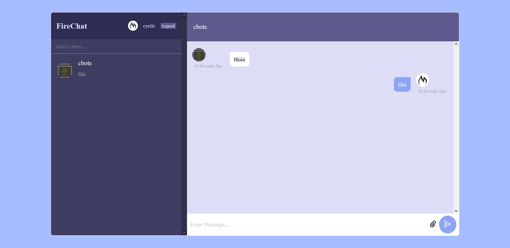

# FireChat

This Chat WebApp is a real-time chat application built with React and Firebase. It allows users to sign in with their Email and Password and engage in real-time conversations with other users.

## Demo

Find working Demo [here](firechat.10cyrilc.me)



## Features

- User authentication using Email and Password
- Real-time messaging with other users
- Ability to send text messages and Images
- Timestamps for each message
- User-friendly and responsive design

## Prerequisites

Before you begin, ensure you have the following prerequisites:

- Node.js and [npm](https://nodejs.org/) (Node Package Manager) installed.

## Getting Started

Follow these steps to get the Chat WebApp up and running:

### 1. Clone the Repository

Clone this repository to your local machine:

```bash
git clone https://github.com/10cyrilc/FireChat.git
cd FireChat
```

### 2. Set Up Firebase

You will need to set up a Firebase project and configure it for this application. Follow these steps:

1. Go to the [Firebase Console](https://console.firebase.google.com/).
2. Create a new Firebase project.
3. In the Firebase project settings, navigate to the "General" tab, and scroll down to find the "Your apps" section. Click on the web app icon (`</>`) to add a new web app to your project.
4. Register the app with a nickname (e.g., "Chat WebApp") and enable Firebase Hosting if you want to deploy your app later.
5. Copy the Firebase config object shown, which contains your Firebase API keys and configuration.

### 3. Configure Firebase

In your project directory, create a file named `.env` and add your Firebase config as environment variables:

```dotenv
VITE_APIKEY=your_api_key
VITE_AUTHDOMAIN=your_auth_domain
VITE_PROJECTID=your_project_id
VITE_STORAGEBUCKET=your_storage_bucket
VITE_APPID=your_messaging_app_id
VITE_MEASUREMENTID=your_measurement_id
```

### 4. Install Dependencies

Install the project dependencies by running the following command in your project directory:

```bash
npm install
```

### 5. Run the Application

Start the development server by running:

```bash
npm run dev
```

The app will be accessible at [http://localhost:3000](http://localhost:3000).

### 6. Sign In and Chat

Open the app in your browser, sign in with your Google account, and start chatting with other users in real-time!

## Contributing

Contributions are welcome! If you have any suggestions, bug reports, or feature requests, please open an issue or submit a pull request.

## License

This project is licensed under the MIT License - see the [LICENSE](LICENSE) file for details.

## Acknowledgments

This project was inspired by the [tutorial](https://www.youtube.com/watch?v=k4mjF4sPITE). Special thanks to [Lama Dev](https://www.youtube.com/@LamaDev) for sharing their knowledge.

Enjoy chatting with your friends using this Chat WebApp! If you encounter any issues, feel free to reach out for support. Happy coding! 🚀📱💬

## Authors

- [@10cyrilc](https://www.github.com/10cyrilc)
